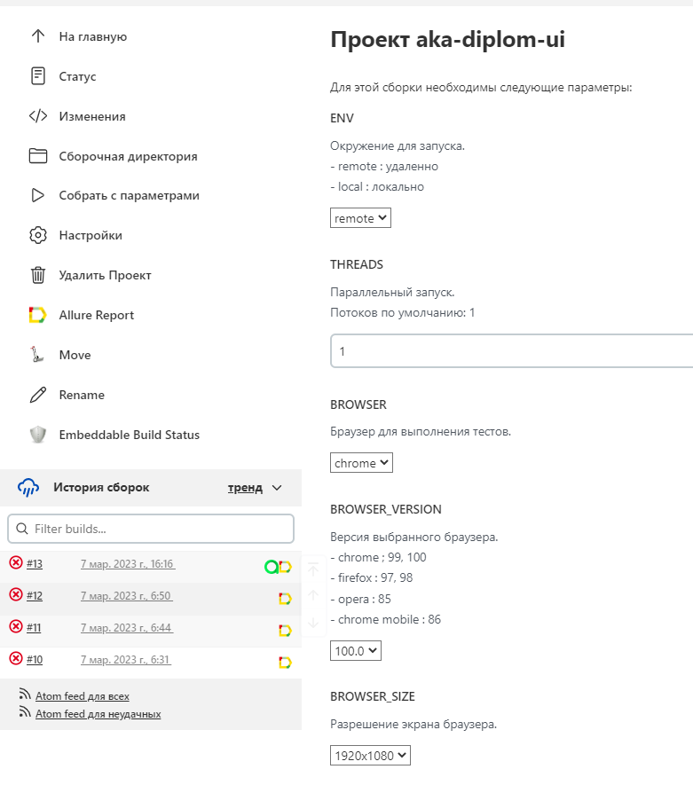
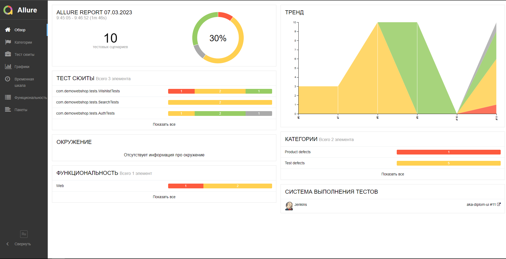
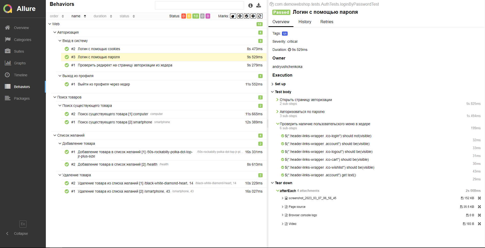
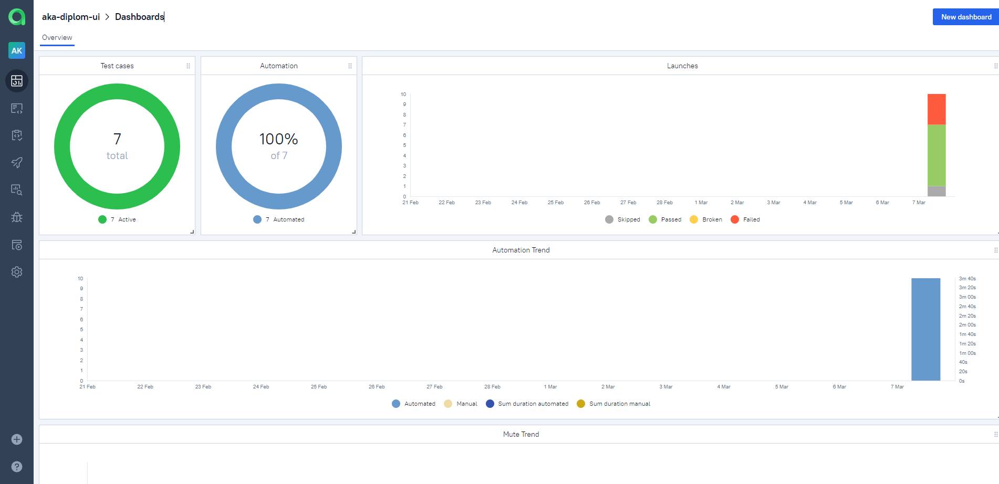
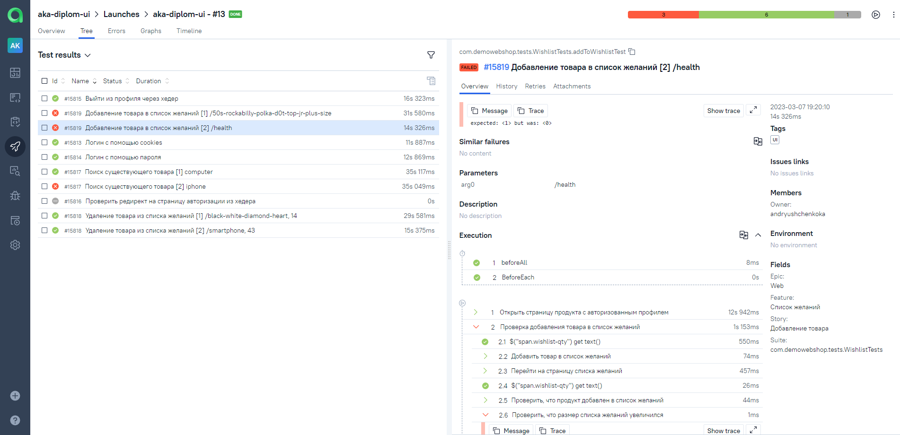
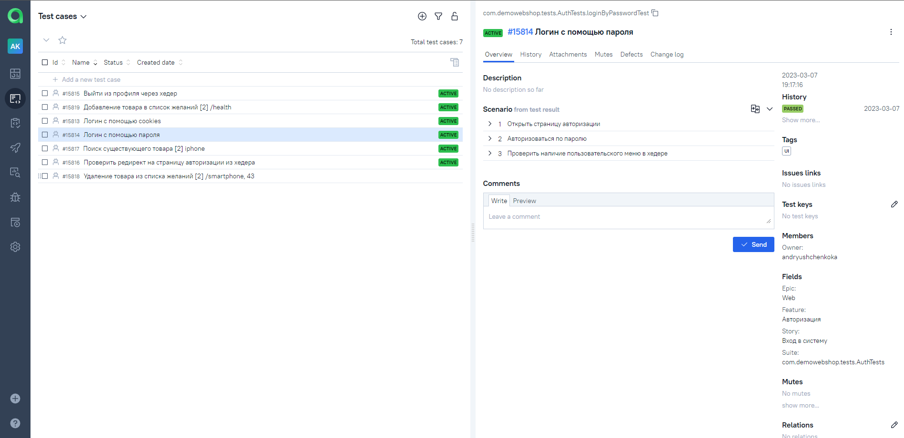

# Дипломный проект по тестированию интернет-магазина [Demo Web Shop](https://demowebshop.tricentis.com/)

## :open_book: Содержание:

- [Технологии и инструменты](#gear-технологии-и-инструменты)
- [Тест кейсы](#heavy_check_mark-Тест-кейсы)
- [Запуск тестов](#computer-запуск-тестов-из-терминала)
- [Примеры использования](#примеры-использования)
- [Запуск тестов в Jenkins](#-запуск-тестов-из-jenkins)
- [Отчет о результатах тестирования в Allure Report](#-отчет-о-результатах-тестирования-в-Allure-report)
- [Интеграция с Allure TestOps](#-интеграция-с-allure-testops)
- [Уведомления в Telegram](#-уведомления-в-telegram)
- [Видео прохождения тестов](#movie_camera-видео-с-прогоном-тестов)

## :gear: Технологии и инструменты

<p align="left">
<a href="https://www.jetbrains.com/idea/"></a>
<a href="https://www.java.com/"></a>
<a href="https://github.com/"></a>
<a href="https://junit.org/junit5/"></a>
<a href="https://gradle.org/"></a>
<a href="https://selenide.org/"></a>
<a href="https://aerokube.com/selenoid/"></a>
<a href="https://github.com/allure-framework/allure2"></a>
<a href="https://www.jenkins.io/"></a>
<a href="https://web.telegram.org/"></a>
<a href="https://qameta.io/"></a>
</p>

В данном проекте автотесты написаны на **Java** с использованием фреймворка для тестирования **Selenide**. Для сборки проекта в среде **IntelliJ IDEA** используется **Gradle**.
**JUnit5** задействован в качестве фреймворка модульного тестирования. Запуск тестов выполняется из **Jenkins**. **Selenoid** используется для запуска браузеров в контейнерах **Docker**.

**Allure Report**, **AllureTestOps** и **Telegram Bot** используются для визуализации результатов тестирования.

## :heavy_check_mark: Тест кейсы

- Проверка авторизации через форму входа
- Проверка авторизации с помощью cookies
- Проверка выхода из профиля
- Проверка редиректа на страницу авторизации
- Проверка добавления продукта в список желаний
- Проверка удаления продукта из списка желаний

## :computer: Запуск тестов из терминала

### :house_with_garden:	Локальный запуск тестов

```bash
./gradlew clean test -Dthreads=${threads_count}"
```

### :earth_asia: Удаленный запуск тестов

```bash
./gradlew clean test
"-Denv=${environment}"
"-Dthreads=${threads_count}"
"-Dbrowser=${browser_name}"
"-DbrowserVersion=${browser_version}"
"-DbrowserSize=${browser_size}"
"-DremoteLog=${remote_login}"
"-DremotePass=${remote_password}"
```
## Примеры использования

### Для запуска удаленных тестов необходимо заполнить remote.properties или передать значение:

* env (окружение - локально или удаленно)
* threads (количество потоков для параллельного запуска, по умолчанию 1)
* browser (браузер, по умолчанию chrome)
* browserVersion (версия браузера, по умолчанию 100.0)
* browserSize (размер окна браузера, по умолчанию 1920x1080)
* remoteLog (логин доступа к Selenoid) 
* remotePass (пароль доступа к Selenoid)

##  Запуск тестов из [Jenkins](https://jenkins.autotests.cloud/job/aka-diplom-ui/)
Для запуска сборки необходимо перейти в раздел <code><strong>*Собрать с параметрами*</strong></code> и нажать кнопку <code><strong>*Собрать*</strong></code>.

<p align="center">
  
</p>

После выполнения сборки, в блоке <code><strong>*История сборок*</strong></code> напротив номера сборки появится
значок *Allure Report* и *Allure TestOps* кликнув по которому, откроется страница с сформированным html-отчетом и тестовой документацией.

##  Отчет о результатах тестирования в [Allure Report](https://jenkins.autotests.cloud/job/aka-diplom-ui/11/allure/)

<p align="center">
  
</p>

<p align="center">
  
</p>

##  Интеграция с [Allure TestOps](https://allure.autotests.cloud/launch/20163)

### Основной дашборд

<p align="center">
  
</p>

### Список тестов с результатами прогона

<p align="center">
  
</p>

### Тест-кейсы

<p align="center">
  
</p>

##  Уведомления в Telegram
После завершения сборки специальный бот, созданный в <code>Telegram</code>, автоматически обрабатывает и отправляет сообщение с отчетом о прогоне тестов.

<p align="center">


## :movie_camera: Видео с прогоном тестов

В отчетах Allure для каждого теста прикреплен не только скриншот, но и видео прохождения теста

<p align="center">
  
</p>
